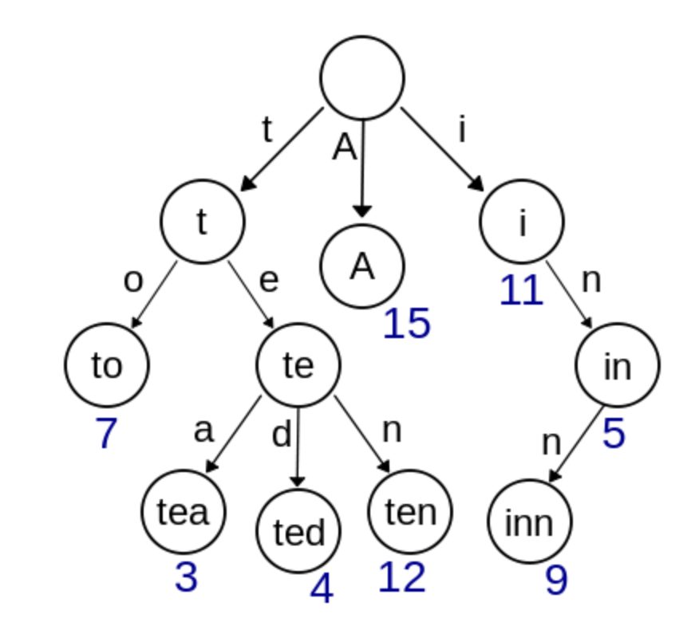
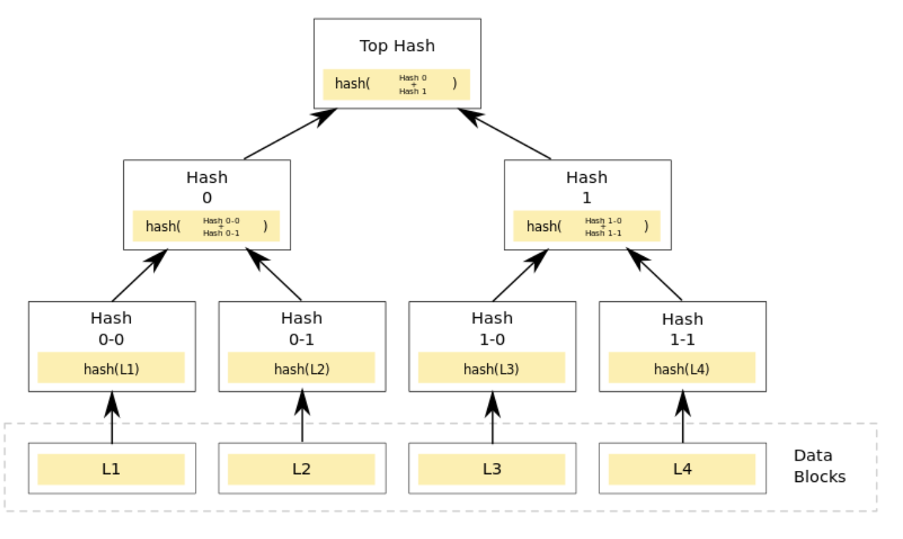
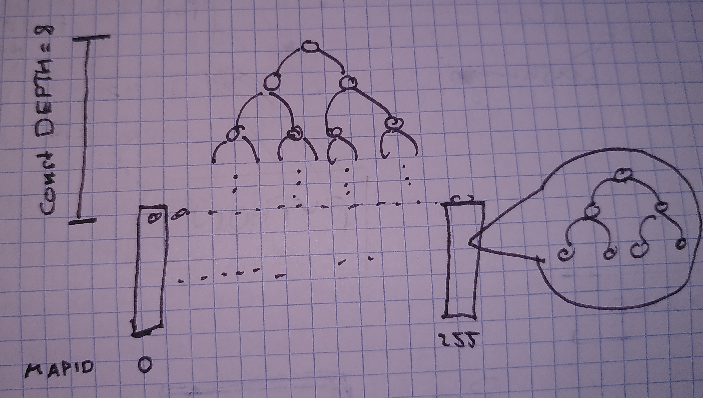

# Tenacious zebra
An efficient and persitent key-value store. 

## Description of the algorithm

### Patricia Trie (Prefix tree, Radix tree)
source: [merkel-patricia-trie](https://medium.com/codechain/modified-merkle-patricia-trie-how-ethereum-saves-a-state-e6d7555078dd)

Trie uses a **key** as a path so the nodes that share the same prefix can also share the same path. This structure is fastest at finding common prefixes, simple to implement, and requires small memory.

  

### Merkel Tree (Hash tree)
source: [merkel-patricia-trie](https://medium.com/codechain/modified-merkle-patricia-trie-how-ethereum-saves-a-state-e6d7555078dd)

Merkle tree is a tree of hashes. Leaf nodes store data. Parent nodes contain their children’s hash as well as the hashed value of the sum of their children’s hashes. 

Finding out whether two different nodes have the same data or not can be efficiently done with the Merkle tree. You first have to compare the Top Hash value of the two nodes. If they are the same, then the two nodes have same data. For example, if you look at the picture above, when there are four nodes (L1, L2, L3, L4), you only need to check whether they have the same Top Hash or not. If the Top Hash is different and you want to know which data is different, you should compare Hash 0 with Hash1 and check which branch is different. By doing so, you will eventually find out which data is different.

  

### Merkle Patricia Trie
TODO

### Parallel execution

  

### Properties of the data structure / algorithm
- Concurrent processing of operations on different keys with minimal thread synchronization.
- Cheap cloning (O(1)).
- Efficient sending to `Databases` containing similar maps (high % of key-value pairs in common)
- Quick validation of the correctness of a tree 