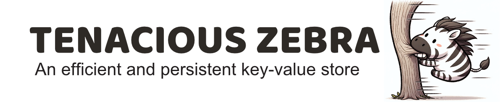

- Concurrent processing of operations on different keys with minimal thread synchronization.
- Cheap cloning (O(1)).
- Efficient sending to `Databases` containing similar maps (high % of key-value pairs in common)
- Quick validation of the correctness of a tree 

---

# Quicks Start

```rust
    let db = Database::<String, usize>::new("test");
    let test_table = db.empty_table("test");

    let mut tx = TableTransaction::new();
    tx.set(format!("first {}", i), i).unwrap();

    test_table.execute(tx).unwrap();

    drop(db);

    let db2 = Database::<String, usize>::new("test");
    let test_table2 = db2.get_table("test").unwrap();

    let mut tx2 = TableTransaction::new();
    let query_key = tx2.get(format!("first {}", i)).unwrap();

    let res = test_table2.execute(tx2).unwrap();

    println!(response.get(&query_key).unwrap());
```

